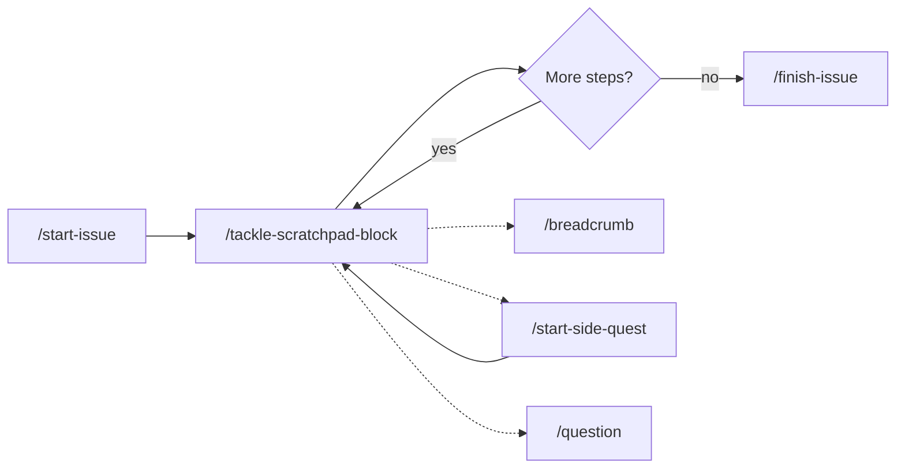

# my-claude-skills

Claude Code is powerful, but out of the box sessions are ephemeral — context evaporates between tasks, there's no trail of decisions made along the way, and commit messages end up as whatever the AI felt like writing. I built these skills because I wanted Claude to be a structured development partner, not just a code generator.

This is a collection of portable [Claude Code skills](https://code.claude.com/docs/en/skills) that add lightweight workflow conventions to every project I work on. They've been iterated over many real issues, PR reviews, and side-quests. Nothing here is theoretical — I use every one of these daily.

## Installation

```bash
git clone git@github.com:couimet/my-claude-skills.git ~/src/my-claude-skills
~/src/my-claude-skills/install.sh
```

This creates symlinks from `~/.claude/skills/` to the repo, making all skills globally available in every Claude Code project. Skills are the [standard Claude Code extension mechanism](https://code.claude.com/docs/en/skills) — each one is a markdown file with instructions that Claude follows when you invoke it.

### Updating

```bash
cd ~/src/my-claude-skills && git pull && ./install.sh
```

The install script is idempotent — safe to run on every pull. It only creates/updates symlinks; it never deletes non-symlink directories.

## Quick Start

Once installed, try these in any project:

### `/scratchpad` — Create a working document

```
/scratchpad plan the authentication refactor
```

Creates a `.scratchpads/0001-plan-the-authentication-refactor.txt` file with structured step tracking. The file is git-ignored — it's your private workspace.

<details>
<summary>See a real scratchpad from this repo</summary>

```
Issue #10 — Add Meat to README: Enrichment Plan

This scratchpad analyzes the current README state and suggests ways
to enrich issue #10 before implementation.

## Gap Analysis

### What's Missing for Beginners
- No explanation of what Claude Code skills even are
- No "what problem does this solve?" framing
- No gentle walkthrough of a first use

### What's Missing for Advanced Users
- No real-world workflow scenarios showing skills composing together
- No illustration of the full issue lifecycle
...
```

Full file: [demo/real-life/issues-10/0001--scratchpad--0004-readme-enrichment-plan-v0001.txt](demo/real-life/issues-10/0001--scratchpad--0004-readme-enrichment-plan-v0001.txt)

</details>

### `/question` — Gather design decisions

```
/question authentication strategy choices
```

Creates a `.claude-questions/0001-authentication-strategy-choices.txt` with structured Q&A. Claude pre-fills recommendations; you edit answers in-file as the single source of truth.

<details>
<summary>See a real question file from this repo</summary>

```
## Q001: Should the root README be the single comprehensive document,
         or should it stay lean and link to deeper pages?

Context: The current README is 25 lines pointing to skills/README.md.

Options:
A) Single comprehensive README - Everything in one scrollable document.
B) Hub-and-spoke - Root README covers intro, link out for details.
C) Progressive disclosure - Heavy use of GitHub's <details> blocks.

Recommendation: A - A single comprehensive README is the most welcoming.

A001: [RECOMMENDED] A
```

Full file: [demo/real-life/issues-10/0002--question--0001-readme-design-decisions-v0001.txt](demo/real-life/issues-10/0002--question--0001-readme-design-decisions-v0001.txt)

</details>

### `/commit-msg` — Draft a commit message

```
/commit-msg add authentication middleware
```

Creates a `.commit-msgs/0001-add-authentication-middleware.txt` focused on WHY, not WHAT — the diff already shows what changed. You review and commit manually; Claude never auto-commits.

<details>
<summary>See a real commit message from this repo</summary>

```
[docs] Bootstrap demo infrastructure and start-issue plan for README overhaul

Establishes the "eat your own dog food" approach: issue #10's own workflow
becomes the README's walkthrough demo. All ephemeral skill artifacts are
persisted in demo/real-life/issues-10/ with a naming convention that makes
the folder a visual timeline.

Benefits:
- Real artifacts replace fabricated examples
- Chronological folder listing tells the story without opening any file
- TIMELINE.md provides narrative context for the full follow-along
```

Full file: [demo/real-life/issues-10/0010--commit-msg--0001-bootstrap-demo-and-start-issue-v0001.txt](demo/real-life/issues-10/0010--commit-msg--0001-bootstrap-demo-and-start-issue-v0001.txt)

</details>

All working files (`.scratchpads/`, `.claude-questions/`, `.commit-msgs/`, `.breadcrumbs/`) are git-ignored automatically. They're your private workspace — only real code and docs get committed.

## See It In Action

These skills aren't meant to be used in isolation — they compose into a full issue lifecycle. Here's the flow:



Every artifact linked below is real — generated while building the README you're reading right now ([issue #10](https://github.com/couimet/my-claude-skills/issues/10)). The full unredacted history lives in [`demo/real-life/issues-10/`](demo/real-life/issues-10/).

### 1. Pre-planning: explore before committing to a plan

Before any branch existed, I used `/scratchpad` to analyze the bare issue and `/question` to surface 12 design decisions. The questions file captures things like: should the README be one page or hub-and-spoke? Real examples or fabricated ones? What tone?

The user answered all 12 questions by editing the file directly — that's the contract. Claude pre-fills `[RECOMMENDED]` answers; the user removes that marker to acknowledge or changes the answer entirely.

<details>
<summary>See how a question evolves from asked to answered</summary>

**Before (Claude's question):**
```
## Q003: Should inline examples use real artifacts from this repo
         or fabricated/generic snippets?

Options:
A) Real artifacts - Actual files from this repo's own workflow.
B) Fabricated - Carefully crafted examples for maximum clarity.
C) Mix - Real artifacts for advanced, fabricated for beginner.

Recommendation: A - Real artifacts are more compelling.

A003: [RECOMMENDED] A
```

**After (user's answer — a game-changer):**
```
A003: A; I'd like to take it further — use the current conversation
as the demo. "Eat your own dog food." Leave issue #10 bare as-is
and build the full-cycle demo from it...
```

Full files: [before](demo/real-life/issues-10/0002--question--0001-readme-design-decisions-v0001.txt) → [after](demo/real-life/issues-10/0003--question--0001-readme-design-decisions-v0002.txt)

</details>

### 2. `/start-issue` — branch + implementation plan

Once design decisions were resolved, `/start-issue` created the `issues/10` branch and produced a formal implementation plan with 6 JSON-tracked steps. Each step has a status (`pending` → `in_progress` → `done`), concrete completion criteria, dependencies, and file lists.

<details>
<summary>See the implementation plan structure</summary>

```json
{
  "steps": [
    {
      "id": "S001",
      "title": "Write README sections 1-3: opening hook, installation, quick start",
      "status": "done",
      "done_when": "README.md has problem-statement hook, updated installation...",
      "depends_on": [],
      "files": ["README.md"]
    },
    {
      "id": "S002",
      "title": "Write README section 4: full workflow walkthrough with Mermaid diagram",
      "status": "in_progress",
      "depends_on": ["S001"]
    }
  ]
}
```

Full file: [demo/real-life/issues-10/0009--scratchpad--0001-start-issue-plan-v0001.txt](demo/real-life/issues-10/0009--scratchpad--0001-start-issue-plan-v0001.txt)

</details>

### 3. `/tackle-scratchpad-block` — execute one step at a time

This is the core loop. You point Claude at a specific step using a code reference — a file path with line numbers:

```
/tackle-scratchpad-block .scratchpads/issues/10/0001-start-issue-plan.txt#L26-L41
```

Claude reads the step, checks its status and dependencies, marks it `in_progress`, executes the work, runs tests, marks it `done`, and drafts a commit message. You review everything and commit manually.

The precision matters: you choose which step to work on, and Claude reads the surrounding plan for context. No ambiguity about what's being requested.

<details>
<summary>See a step transition from pending to done</summary>

**Before executing S001:**
```json
"id": "S001",
"title": "Write README sections 1-3: opening hook, installation, quick start",
"status": "pending",
```

**After execution:**
```json
"id": "S001",
"title": "Write README sections 1-3: opening hook, installation, quick start",
"status": "done",
```

Compare: [before](demo/real-life/issues-10/0009--scratchpad--0001-start-issue-plan-v0001.txt) → [after](demo/real-life/issues-10/0013--scratchpad--0001-start-issue-plan-v0002.txt)

</details>

### 4. Side-quests and breadcrumbs

Mid-issue, you'll often notice orthogonal improvements — a helper function that deserves its own PR, a naming inconsistency worth fixing. Instead of polluting the current branch:

- **`/breadcrumb`** drops a timestamped note that `/finish-issue` collects later
- **`/start-side-quest`** creates a separate branch, tracks the detour, and returns you to the main issue when done

### 5. `/finish-issue` — wrap up with a PR description

When all steps are done, `/finish-issue` verifies the work, collects breadcrumbs, checks documentation needs, and generates a PR description. The description links back to the plan and summarizes what was done and why.

### Following along

The [`demo/real-life/issues-10/`](demo/real-life/issues-10/) folder contains every artifact from this issue's lifecycle — scratchpads, questions, commit messages, and README snapshots — numbered chronologically. [`TIMELINE.md`](demo/real-life/issues-10/TIMELINE.md) provides the narrative context for each one.

## Why I Built These

I've used Claude Code on dozens of real issues and kept running into the same friction points. These skills encode the patterns that worked:

- **Files over chat.** Every decision, plan, and question lives in a file — not buried in terminal scroll. If you use [RangeLink](https://github.com/couimet/rangeLink) or similar tools, the file references become clickable navigation.
- **Crash-proof context.** Claude Code sessions can compact, disconnect, or run out of context. Because everything is written to disk as it happens, you can resume from any scratchpad in a fresh session without losing anything.
- **Organized, not scattered.** Working files go in predictable locations (`.scratchpads/`, `.claude-questions/`, `.commit-msgs/`, `.breadcrumbs/`) with auto-numbering and issue-scoped subdirectories. No manual file management.
- **You control execution.** Claude proposes plans and drafts commit messages. You review, edit, and execute. No auto-commits, no surprise pushes, no "let me just fix that for you."
- **Ephemeral vs. permanent.** Working files are git-ignored — they're your private workspace. Only real code and documentation get committed. This distinction is enforced by convention, not tooling.
- **Plan, then execute.** `/start-issue` creates the plan. `/tackle-scratchpad-block` executes one step at a time. The plan is always visible, always editable, always the source of truth for what's left to do.
- **No magic.** These are plain markdown files that Claude reads as instructions. There's no framework, no runtime, no dependencies. Fork the repo, edit a `SKILL.md`, and changes take effect immediately — symlinks mean edits are picked up without re-running anything. You only run `install.sh` again when adding or removing skills.

## Skills Reference

### What You Type

| Command | What It Does |
| --- | --- |
| `/scratchpad <desc>` | Create a working document — plans, analysis, PR drafts, anything temporary |
| `/question <topic>` | Surface design decisions as a structured Q&A file you edit in-place |
| `/commit-msg <desc>` | Draft a commit message focused on WHY, not WHAT |
| `/breadcrumb <note>` | Drop a timestamped note collected by `/finish-issue` for the PR description |
| `/start-issue <url>` | Analyze a GitHub issue, create a branch, and produce an implementation plan |
| `/tackle-scratchpad-block <path#lines>` | Execute a specific step from a plan — the core implementation loop |
| `/start-side-quest <desc>` | Branch off for an orthogonal improvement without polluting the current issue |
| `/tackle-pr-comment <url>` | Analyze PR feedback and create a plan to address it |
| `/finish-issue` | Verify work, collect breadcrumbs, check docs, and generate a PR description |

### What Works Automatically

These skills aren't invoked directly — Claude consults them when the context matches.

| Skill | When It Activates |
| --- | --- |
| `code-ref` | When generating file/line references — formats them as GitHub-style permalinks, clickable in editors with [RangeLink](https://github.com/couimet/rangeLink) installed (VS Code/Cursor don't recognize the suffix natively) |
| `file-placement` | When deciding where to put a new file — routes to the right directory |
| `issue-context` | When on an `issues/<N>` branch — scopes working files to issue subdirectories |
| `prose-style` | When writing prose to working files — applies consistent formatting conventions |

For architecture details, the two-tier design, and step tracking schema, see [skills/README.md](skills/README.md).
