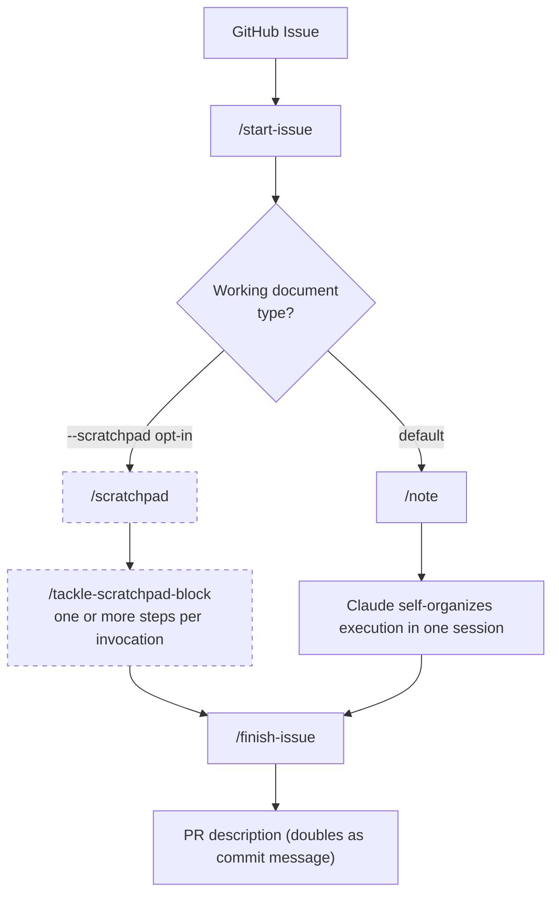

Mermaid source for the note-vs-scratchpad workflow diagram. Rendered to `media/2026-05-devto-post-from-scratchpad-to-note-workflow-diagram.png`.

<!-- Extract the fenced mermaid block from this file into a temp file, then: mmdc -i <temp> -o media/2026-05-devto-post-from-scratchpad-to-note-workflow-diagram.png -b transparent -->

